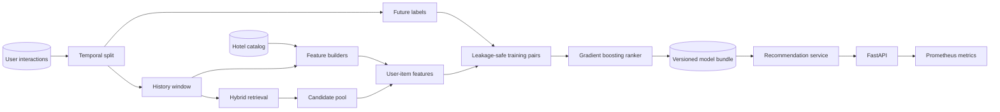
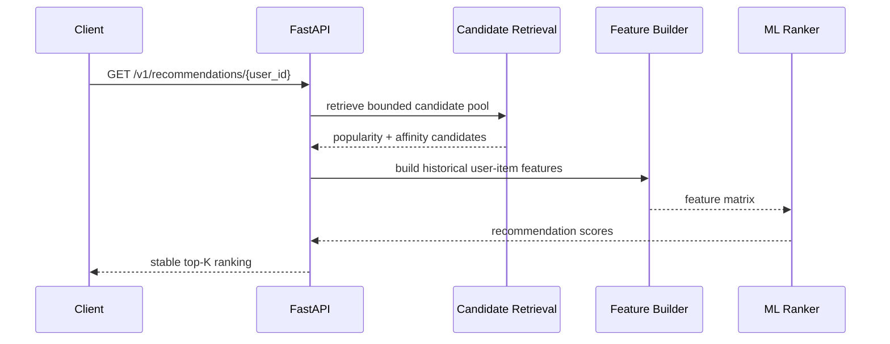

<div align="center">

# 🏨 Production Hotel Recommender

### Production-grade reference architecture for personalized hotel ranking

**Hybrid candidate retrieval → leakage-safe ML ranking → temporal evaluation → FastAPI serving**

[](https://github.com/antony502189-max/Production-Hotel-Recommender/actions/workflows/ci.yml)


A complete recommendation-system portfolio project that turns behavioral history into ranked hotel
recommendations while explicitly handling the engineering problems usually hidden by notebooks:
**temporal leakage, candidate retrieval, cold start, artifact compatibility, reproducible evaluation,
API serving, observability and automated testing**.

**Reference benchmark:** `Recall@10 = 0.1075` vs `0.0805` popularity baseline — **+33.6% relative lift**.

[Case Study](docs/case-study.md) • [Architecture](docs/architecture.md) • [Model Card](docs/model-card.md) • [Benchmark Methodology](docs/benchmark.md) • [API](#api) • [Quick Start](#quick-start)

</div>

---

## Why this repository stands out

This is not a notebook wrapped in an API. The repository is structured around the lifecycle of a real ML service:

| Layer | What is implemented |
|---|---|
| **Retrieval** | popularity + city affinity + hotel-type affinity + deterministic cold start |
| **Ranking** | supervised gradient-boosting ranker over historical user-item features |
| **Validation** | temporal holdout, explicit history/label separation, ranking metrics |
| **Baseline** | popularity recommender evaluated on the exact same future holdout |
| **Artifact** | version, feature schema, training metadata and deterministic fingerprint |
| **Serving** | FastAPI recommendation endpoint, model metadata and degraded startup |
| **Observability** | Prometheus request counters, latency histograms and health/readiness |
| **Deployment** | Docker / Docker Compose, non-root runtime |
| **Quality** | deterministic data generation, tests and green GitHub Actions CI |

> **Portfolio signal:** the project demonstrates ML, data-science methodology, ML engineering and software engineering in one coherent system.

---

## At a glance

| | |
|---|---|
| **Problem** | Rank the most relevant hotels for each user from behavioral history |
| **Architecture** | Two-stage recommender: hybrid retrieval → gradient-boosting ranker |
| **Evaluation** | Temporal holdout with Recall@K, NDCG@K, MRR@K and HitRate@K |
| **Serving** | FastAPI REST API with artifact metadata and readiness checks |
| **Observability** | Prometheus metrics + structured application logs |
| **Reproducibility** | Fixed-seed synthetic data + machine-readable offline metrics |
| **Deployment** | Docker / Docker Compose |
| **CI** | Python 3.11 install → compile → pytest on every push/PR to `main` |

### Reference result

> **Recall@10: 0.1075 vs 0.0805 popularity baseline — +33.6% relative lift**

The benchmark is deterministic and reproducible from the repository. The bundled dataset is synthetic;
the result demonstrates system design and evaluation discipline rather than real-world travel performance.

For the full portfolio narrative, see [`docs/case-study.md`](docs/case-study.md).

---

## The problem

A hotel recommender has to solve more than a classification task. At request time, the system cannot
score every hotel blindly, use information from the future, or fail when a new user has no history.

This project models the recommendation workflow as an end-to-end ML system:

1. **retrieve** a compact candidate pool from behavioral signals;
2. **construct** point-in-time user-item features from historical interactions;
3. **rank** candidates with a supervised gradient-boosting model;
4. **evaluate** the ranking on future interactions using a temporal holdout;
5. **package** the trained model together with its feature schema and provenance;
6. **serve** recommendations through a production-style API;
7. **monitor** service health and request telemetry.

The result is intentionally structured as an application rather than a single training notebook.

---

## Offline benchmark

Reference benchmark configuration:

```text
seed          = 42
users         = 1,200
hotels        = 320
interactions  = 45,000
K             = 10
```

| Metric | ML ranker | Popularity baseline | Relative improvement |
|---|---:|---:|---:|
| **Recall@10** | **0.1075** | 0.0805 | **+33.6%** |
| **NDCG@10** | **0.0673** | 0.0377 | **+78.3%** |
| **MRR@10** | **0.0599** | 0.0285 | **+109.8%** |
| **HitRate@10** | **0.1267** | 0.0998 | **+26.9%** |

Reproduce the benchmark:

```bash
python scripts/evaluate.py \
  --users 1200 \
  --hotels 320 \
  --interactions 45000 \
  --k 10
```

Both recommenders are evaluated against the **same future holdout**. The model is not compared against
an unrelated or easier split merely to produce a better-looking number.

Full methodology: [`docs/benchmark.md`](docs/benchmark.md)

---

## System architecture



### Online request path



Detailed design notes: [`docs/architecture.md`](docs/architecture.md)

---

## ML design

### Stage 1 — hybrid candidate retrieval

The first stage reduces the catalog to a bounded candidate set using inexpensive behavioral signals:

- **global popularity** from weighted historical events;
- **city affinity** learned from the user's interaction history;
- **accommodation-type affinity** learned from the same history;
- deterministic **cold-start fallback** for unseen users.

Retrieval exists for an important systems reason: the ranking model should score a useful candidate
pool, not perform an unbounded full-catalog scan on every request.

### Stage 2 — supervised ranking

Candidates are scored with `HistGradientBoostingClassifier`. The model estimates booking propensity
from features that are available **before** the target interaction occurs.

| Feature group | Features |
|---|---|
| Popularity | `item_popularity`, `historical_booking_rate` |
| User-item affinity | `city_affinity`, `type_affinity` |
| Preference fit | `price_fit`, `star_fit` |
| Prior engagement | `prior_views`, `prior_clicks` |
| Item context | `log_price`, `stars_scaled` |

### Leakage prevention

One of the easiest ways to overstate recommender quality is to build features from the same event later
used as the label. This repository avoids that failure mode by separating the training data into an
earlier **feature-history window** and a later **label window** before training examples are constructed.

### Model artifact contract

The serialized `RecommenderBundle` contains both the estimator and the context required to serve it:

- trained ranker;
- hotel catalog;
- historical interactions;
- item statistics;
- user profiles;
- exact feature schema;
- model version;
- training timestamp;
- training row count;
- positive-label rate;
- deterministic training-data fingerprint.

The loader validates the feature schema before serving, preventing an incompatible artifact from being
silently loaded by newer application code.

Standalone model documentation: [`docs/model-card.md`](docs/model-card.md)

---

## Repository structure

```text
Production-Hotel-Recommender/
├── .github/
│   └── workflows/
│       └── ci.yml                  # install, compile and test on GitHub Actions
├── docs/
│   ├── architecture.md             # architecture and design decisions
│   ├── benchmark.md                # evaluation methodology and interpretation
│   ├── case-study.md               # portfolio / recruiter-oriented project narrative
│   ├── ci-verification.md          # CI contract and validation notes
│   └── model-card.md               # intended use, metrics, limitations and monitoring
├── scripts/
│   ├── train.py                    # reproducible training CLI
│   └── evaluate.py                 # temporal offline benchmark
├── src/hotel_recommender/
│   ├── api.py                      # FastAPI + Prometheus instrumentation
│   ├── candidates.py               # hybrid candidate retrieval
│   ├── config.py                   # typed environment settings
│   ├── data.py                     # validation + vectorized data generator
│   ├── domain.py                   # domain and artifact contracts
│   ├── features.py                 # feature engineering
│   ├── metrics.py                  # Recall/NDCG/MRR/HitRate
│   ├── model.py                    # ranker construction and scoring
│   ├── pipeline.py                 # leakage-safe training pipeline
│   ├── service.py                  # online recommendation service
│   └── storage.py                  # artifact loading and schema validation
├── tests/
│   ├── test_data.py
│   ├── test_metrics.py
│   └── test_service.py
├── Dockerfile
├── docker-compose.yml
├── Makefile
├── pyproject.toml
└── README.md
```

---

## Quick start

### 1. Create a virtual environment

```bash
python -m venv .venv
```

Linux/macOS:

```bash
source .venv/bin/activate
```

Windows PowerShell:

```powershell
.venv\Scripts\Activate.ps1
```

### 2. Install the project

```bash
python -m pip install -e ".[dev]"
```

### 3. Train the recommender

```bash
python scripts/train.py
```

The artifact is written to:

```text
artifacts/recommender.joblib
```

### 4. Start the API

```bash
uvicorn hotel_recommender.api:app --reload
```

Swagger UI:

```text
http://localhost:8000/docs
```

---

## API

### Get recommendations

```http
GET /v1/recommendations/42?k=10&exclude_seen=false
```

Example response:

```json
{
  "user_id": 42,
  "model_version": "1.0.0",
  "recommendations": [
    {
      "hotel_id": 181,
      "score": 0.8741,
      "city": "Vienna",
      "hotel_type": "boutique",
      "price": 128.42,
      "stars": 4
    }
  ]
}
```

### Operational endpoints

| Endpoint | Purpose |
|---|---|
| `GET /health` | service readiness and model-loaded state |
| `GET /v1/model` | model version, metadata, feature schema and fingerprint |
| `GET /metrics` | Prometheus-compatible telemetry |
| `GET /docs` | interactive OpenAPI / Swagger documentation |

If the model artifact is missing, the application starts in **degraded mode** rather than crashing.
Health information remains available while recommendation requests return `503` until the model is ready.

---

## Docker

```bash
docker compose up --build
```

The production image:

- uses Python 3.11 slim;
- runs the application as a non-root user;
- creates a deterministic demo artifact during build;
- exposes an application health check;
- starts Uvicorn on port `8000`.

---

## Quality and CI

Local quality commands:

```bash
make lint
make test
make evaluate
```

GitHub Actions runs on every push and pull request to `main` and validates the repository with:

1. Python 3.11 environment setup;
2. package installation from `pyproject.toml`;
3. byte-compilation of `src`, `scripts` and `tests`;
4. the complete pytest suite.

The test suite covers deterministic data generation, strict temporal splitting, ranking metrics,
recommendation ordering and uniqueness, and cold-start behavior.

---

## Observability

The service exposes operational signals suitable for a lightweight production deployment:

- HTTP request counts;
- request-latency histograms;
- readiness / model-loaded state;
- inspectable model metadata;
- structured application logs.

Prometheus endpoint:

```text
http://localhost:8000/metrics
```

A real production deployment should additionally monitor candidate coverage, recommendation diversity,
feature drift, training-serving skew and online business metrics.

---

## Engineering decisions

| Decision | Rationale |
|---|---|
| **Two-stage architecture** | separates inexpensive retrieval from more expensive ML ranking |
| **Temporal evaluation** | reflects future recommendation behavior better than a random split |
| **Popularity baseline** | demonstrates whether ML actually adds ranking value |
| **History/label separation** | prevents target leakage during feature construction |
| **Explicit cold start** | makes unseen-user behavior deterministic and testable |
| **Versioned artifact metadata** | makes model provenance inspectable |
| **Feature-schema validation** | prevents incompatible artifacts from being served silently |
| **Synthetic deterministic data** | keeps the repository runnable without proprietary datasets |
| **FastAPI + Prometheus** | demonstrates serving and observability, not only training |

---

## Production roadmap

A real travel platform would extend this reference implementation with:

- collaborative filtering or embedding / ANN candidate retrieval;
- session/search context, dates, destination and guest constraints;
- point-in-time-correct online/offline feature store;
- MLflow or another model registry;
- Redis or a dedicated online feature cache;
- scheduled retraining with Airflow / Prefect;
- data-quality and feature-drift monitoring;
- diversity, novelty and business-rule re-ranking;
- privacy, consent and retention controls;
- online A/B experiments and business guardrails;
- canary or shadow model deployment.

The repository intentionally keeps those as extensions rather than pretending a synthetic demo is a
fully deployed commercial travel platform.

---

## Documentation

| Document | Purpose |
|---|---|
| [`Case Study`](docs/case-study.md) | compact portfolio narrative: problem → architecture → results → trade-offs |
| [`Architecture`](docs/architecture.md) | detailed system design and implementation decisions |
| [`Model Card`](docs/model-card.md) | model inputs, intended use, metrics, limitations and monitoring |
| [`Benchmark`](docs/benchmark.md) | evaluation split, metrics, baseline and reproducibility methodology |
| [`CI Verification`](docs/ci-verification.md) | automated validation contract |

---

## Reproducibility

All bundled demo data is generated from a fixed NumPy random seed. Offline evaluation writes
machine-readable metrics to `reports/offline_metrics.json`. Generated reports and model artifacts are
excluded from Git so the repository remains lightweight and reproducible.

---

## License

MIT — see [`LICENSE`](LICENSE).
