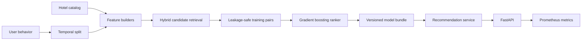
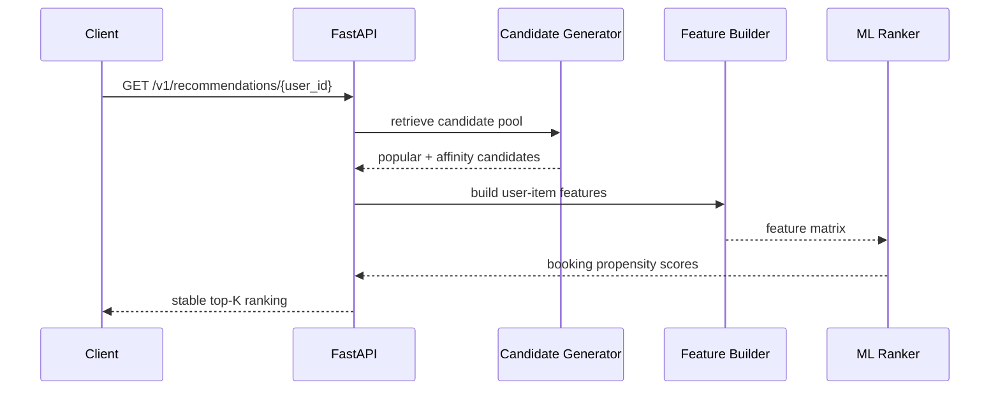

<div align="center">

# 🏨 Production Hotel Recommender

### Two-stage recommendation system: hybrid retrieval → ML ranking → FastAPI serving

[](https://github.com/antony502189-max/Production-Hotel-Recommender/actions/workflows/ci.yml)


A production-oriented portfolio project that demonstrates the complete lifecycle of a recommender
system: **data generation, leakage-safe feature engineering, candidate retrieval, ranking,
offline evaluation, model packaging, API serving, observability, Docker and CI**.

</div>

---

## Why this project exists

A recommendation notebook is easy to build. A recommendation **system** is not.

This repository focuses on the engineering and modeling decisions that matter outside a notebook:

- deterministic and validated input data;
- temporal train/holdout separation;
- explicit cold-start behavior;
- two-stage retrieval and ranking;
- target-leakage prevention during training;
- ranking metrics instead of classification accuracy;
- comparison against a simple popularity baseline;
- versioned model metadata and feature-schema validation;
- REST inference with health/model endpoints;
- Prometheus-compatible telemetry;
- containerized deployment and automated CI.

> **Scope:** the bundled dataset is synthetic and deterministic. The goal is to demonstrate
> production ML architecture and evaluation discipline, not to claim real-world travel performance.

---

## Reference benchmark

Deterministic synthetic benchmark (`seed=42`, `1,200 users`, `320 hotels`, `45,000 events`, `K=10`):

| Metric | ML ranker | Popularity baseline | Improvement |
|---|---:|---:|---:|
| Recall@10 | **0.1075** | 0.0805 | **+33.6%** |
| NDCG@10 | **0.0673** | 0.0377 | **+78.3%** |
| MRR@10 | **0.0599** | 0.0285 | **+109.8%** |
| HitRate@10 | **0.1267** | 0.0998 | **+26.9%** |

Reproduce it locally:

```bash
python scripts/evaluate.py \
  --users 1200 \
  --hotels 320 \
  --interactions 45000 \
  --k 10
```

The evaluation uses a temporal holdout and reports both the learned ranker and the popularity
baseline from the same training history.

---

## System architecture



### Online request path



More detail: [`docs/architecture.md`](docs/architecture.md)

---

## ML design

### Stage 1 — candidate retrieval

The retrieval layer combines:

1. **global popularity** from weighted historical events;
2. **city affinity** learned from user behavior;
3. **accommodation-type affinity** learned from user behavior;
4. deterministic fallback for new users.

This keeps online scoring bounded: the ranker scores a candidate pool rather than the entire catalog.

### Stage 2 — ranking

The ranker is a `HistGradientBoostingClassifier` trained on later booking events while features are
constructed only from an earlier history window.

Feature groups:

| Group | Features |
|---|---|
| Popularity | `item_popularity`, `historical_booking_rate` |
| User-item affinity | `city_affinity`, `type_affinity` |
| Preference fit | `price_fit`, `star_fit` |
| Prior engagement | `prior_views`, `prior_clicks` |
| Item context | `log_price`, `stars_scaled` |

### Why the training split matters

A common recommender-system mistake is to derive features from the same booking event used as the
label. This repository avoids that by creating an **internal history/label-window split** before
constructing training examples.

---

## Repository structure

```text
Production-Hotel-Recommender/
├── .github/workflows/ci.yml       # lint, tests, Docker build
├── docs/
│   └── architecture.md            # design decisions + model card
├── scripts/
│   ├── train.py                   # training CLI
│   └── evaluate.py                # offline benchmark + baseline
├── src/hotel_recommender/
│   ├── api.py                     # FastAPI + Prometheus
│   ├── candidates.py              # hybrid retrieval
│   ├── config.py                  # typed environment settings
│   ├── data.py                    # validation + vectorized synthetic generator
│   ├── domain.py                  # artifact/domain contracts
│   ├── features.py                # item/user/candidate features
│   ├── metrics.py                 # Recall/NDCG/MRR/HitRate
│   ├── model.py                   # ranker construction/scoring
│   ├── pipeline.py                # leakage-safe training pipeline
│   ├── service.py                 # online recommendation service
│   └── storage.py                 # artifact loading/schema validation
├── tests/
│   ├── test_data.py
│   ├── test_metrics.py
│   └── test_service.py
├── Dockerfile
├── docker-compose.yml
├── Makefile
└── pyproject.toml
```

---

## Quick start

### 1. Create an environment

```bash
python -m venv .venv
```

Linux/macOS:

```bash
source .venv/bin/activate
```

Windows PowerShell:

```powershell
.venv\Scripts\Activate.ps1
```

### 2. Install

```bash
python -m pip install -e ".[dev]"
```

### 3. Train a model

```bash
python scripts/train.py
```

The model artifact is written to:

```text
artifacts/recommender.joblib
```

### 4. Run the API

```bash
uvicorn hotel_recommender.api:app --reload
```

Open Swagger UI:

```text
http://localhost:8000/docs
```

---

## API

### Recommendations

```http
GET /v1/recommendations/42?k=10&exclude_seen=false
```

Example response:

```json
{
  "user_id": 42,
  "model_version": "1.0.0",
  "recommendations": [
    {
      "hotel_id": 181,
      "score": 0.8741,
      "city": "Vienna",
      "hotel_type": "boutique",
      "price": 128.42,
      "stars": 4
    }
  ]
}
```

### Operations

| Endpoint | Purpose |
|---|---|
| `GET /health` | readiness/model-loaded state |
| `GET /v1/model` | model version, training metadata, feature schema and fingerprint |
| `GET /metrics` | Prometheus metrics |
| `GET /docs` | interactive OpenAPI/Swagger documentation |

If the artifact is missing, the application starts in **degraded mode** instead of crashing. Health
information remains available while recommendation endpoints return `503`.

---

## Docker

Build and run everything with one command:

```bash
docker compose up --build
```

The image:

- runs as a non-root user;
- trains a deterministic demo artifact during build;
- exposes a Docker health check;
- starts Uvicorn on port `8000`.

---

## Quality gates

```bash
make lint
make test
make evaluate
```

CI runs on every push to `main` and every pull request:

1. install the package;
2. run Ruff;
3. run unit tests;
4. build the production Docker image.

The current local validation suite covers deterministic data generation, strict temporal splitting,
ranking metrics, ranking order/uniqueness and cold-start recommendations.

---

## Model artifact contract

The serialized `RecommenderBundle` contains:

- trained ranker;
- hotel catalog;
- historical interactions;
- item statistics;
- user profiles;
- model version;
- training timestamp;
- training row count;
- positive-label rate;
- exact feature schema;
- deterministic training-data fingerprint.

`load_bundle()` validates the feature schema before serving. This prevents an incompatible old model
from being silently loaded by newer application code.

---

## Observability

The service exports:

- request counts by method/path/status;
- request latency histograms;
- health/readiness state;
- model metadata and fingerprint;
- structured application logs.

Prometheus endpoint:

```text
http://localhost:8000/metrics
```

---

## Engineering decisions

| Decision | Reason |
|---|---|
| Two-stage recommender | separates cheap retrieval from expensive ranking |
| Temporal evaluation | closer to real recommendation deployment than random split |
| Popularity baseline | proves the ML model adds value over a trivial solution |
| Synthetic generator | repository is runnable without private/proprietary data |
| Histogram gradient boosting | strong tabular baseline with lightweight serving |
| Explicit cold start | behavior for unseen users is deterministic and testable |
| Model metadata | makes artifact provenance inspectable |
| Prometheus metrics | demonstrates production observability concerns |

---

## Limitations and production roadmap

This repository intentionally stops short of pretending synthetic data is production data. A real
travel recommender would extend the system with:

- ANN/collaborative-filtering candidate retrieval;
- search/session context, dates, guests and destination constraints;
- feature store with point-in-time correctness;
- MLflow or equivalent model registry;
- Redis/online feature cache;
- orchestration with Airflow/Prefect;
- drift and data-quality monitoring;
- diversity/novelty/business-rule re-ranking;
- consent, privacy and retention controls;
- online A/B testing and guardrail metrics;
- canary/shadow model deployment.

---

## Reproducibility

All demo data is generated from a fixed NumPy random seed. The evaluation script saves machine-readable
metrics to `reports/offline_metrics.json`, while training artifacts and generated reports are excluded
from Git to keep the repository clean.

---

## License

MIT. See [`LICENSE`](LICENSE).
