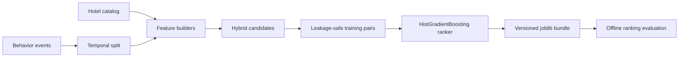
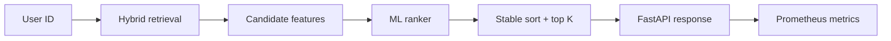

# Architecture and model design

## Goal

Return a short ranked list of hotels for a user while keeping training reproducible, serving simple,
and cold-start behavior explicit. The project deliberately separates **retrieval** from **ranking**.

## Offline flow

The ranker is trained on an internal history/label-window split. User/item features are constructed
from the history side; bookings from the later window provide positive labels. This avoids the common
portfolio mistake of letting the target event directly leak into its own features.

## Online flow

### Retrieval

Candidate generation unions two inexpensive sources:

1. globally popular hotels from historical weighted events;
2. hotels matching the user's strongest city and accommodation-type affinities.

New users fall back naturally to popularity.

### Ranking

The ranker uses ten bounded/normalized features spanning popularity, user-item affinity, price fit,
star fit, prior engagement and historical conversion signal. A histogram gradient boosting classifier
is used because it is fast on tabular data and handles nonlinear interactions without heavyweight
serving infrastructure.

## Artifact contract

`RecommenderBundle` stores the model, catalog, historical interactions, derived statistics, user
profiles and metadata. Loading validates the feature schema before serving, preventing an old model
from silently running against incompatible application code.

## Observability

The API exposes:

- `GET /health` for readiness state;
- `GET /v1/model` for model metadata and training fingerprint;
- `/metrics` in Prometheus format;
- request count and latency histograms.

## Model card

**Intended use:** demonstration of production ML architecture and recommendation-system mechanics.

**Training data:** deterministic synthetic hotel catalog and user behavior with latent geography,
type, price and star preferences.

**Not intended for:** real travel recommendations, pricing decisions or claims about Expedia/Booking
performance. A real deployment would require consent/privacy controls, bias analysis, freshness SLAs,
feature-store semantics and online experimentation.

**Primary offline metrics:** Recall@K, NDCG@K, MRR@K and HitRate@K.
